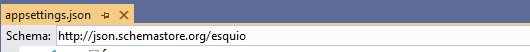
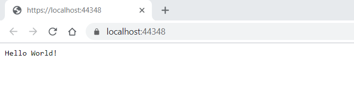
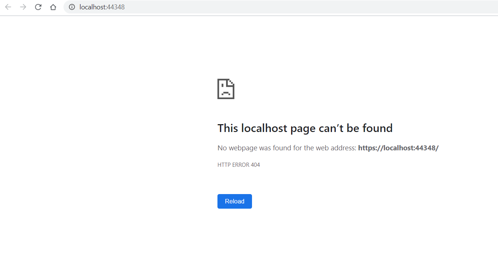
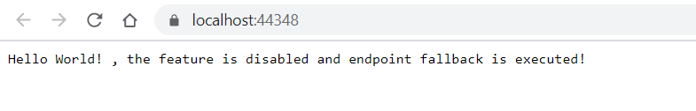

Getting started with Esquio in ASP.NET Core
============================================

In this article, we are going to watch an incremental sample to show how to use to use Esquio in your ASP.NET Core application.

Intro
^^^^^

> In `samples/GettingStarted.AspNetCore.Intro <https://github.com/Xabaril/Esquio/tree/master/samples/GettingStarted.AspNetCore.Intro>`_ you'll find this example in ASP.NET Core.

First, create a new project empty::

        dotnet new web -n GettingStarted.AspNetCore.Intro

Install ``Esquio.AspNetCore`` package, typing the following command using the .NET Core CLI::

        dotnet add package Esquio.AspNetCore

or using Powershell or Package Manager::

        Install-Package Esquio.AspNetCore

or install via NuGet.

In the **ConfigureServices** method of Startup.cs, register the Esquio services::

        services
          .AddEsquio()
          .AddAspNetCoreDefaultServices();

``AddEsquio`` registers the default services for Esquio
``AddAspNetCoreDefaultServices`` register the default ASP.NET Core services for Esquio (i.e. claims or environment services)


Setting ConfigurationStore
^^^^^^^^^^^^^^^^^^^^^^^^^^

Let's start using our ``appsettings.json`` to configurate Esquio. We don't recommend this store for production, only for small projects or for testing purposes.

Install ``Esquio.AspNetCore`` package, typing the following command using the .NET Core CLI::

        dotnet add package Esquio.Configuration.Store

or using Powershell or Package Manager::

        Install-Package Esquio.Configuration.Store

or install via NuGet.

And register the specific service for this store::

    public class Startup
    {
        IConfiguration _configuration;

        public Startup(IConfiguration configuration)
        {
            _configuration = configuration;
        }

        public void ConfigureServices(IServiceCollection services)
        {
            services
                .AddEsquio()
                .AddAspNetCoreDefaultServices()
                .AddConfigurationStore(_configuration);
        }

``AddConfigurationStore`` method registers the configuration store to use, in this case, based on the default configuration system of `ASP.NET Core <https://docs.microsoft.com/en-us/aspnet/core/fundamentals/configuration/?view=aspnetcore-2.2>`_

So, let's open our ``appsettings.json`` file. To help us in this task, we can use the Esquio schema, selecting it on the ``Schema`` options:



Add the content below to your ``appsettings.json`` file::

```json
        {
          "Esquio": {
            "Products": [
              {
                "Name": "default",
                "Features": [
                  {
                    "Name": "HiddenGem",
                    "Enabled": true,
                    "Toggles": []
                  }
                ]
              }
            ]
          }
        }
```

By default, ``Esquio`` will be the root element. However, you could change it on adding the configurationStore::

                .AddConfigurationStore(_configuration, key: "MyNewCustomRoot");

With this configuration, we are defining a new ``feature`` named ``HiddenGem``, initially set to enabled, but with no toggle on it.

In order to test it, let's use the current endpoint already defined on the method ``Configure`` on the class ``Startup``. We can attach feature metadata to an endpoint using the route mappings configuration fluent API ``RequireFeature`` method::

```csharp
            app.UseEndpoints(endpoints =>
            {
                endpoints.MapGet("/", async context =>
                {
                    await context.Response.WriteAsync("Hello World!");
                }).RequireFeature("HiddenGem");
            });
```

This method will filter if the endpoint can be executed depending on feature(s) state. If the configured feature is enabled this endpoint is executed, if not, by default a NotFound result is obtained.

So, if we run the project with this configuration, we will reach this endpoint:



However, let's modify the configuration file again, setting ``Enabled`` property to false, and refresh the browser::

```json
                "Features": [
                  {
                    "Name": "HiddenGem",
                    "Enabled": false,
                    "Toggles": []
                  }
                ]
```




Exploring more options
^^^^^^^^^^^^^^^^^^^^^^

> In `samples/GettingStarted.AspNetCore.IntroOptions <https://github.com/Xabaril/Esquio/tree/master/samples/GettingStarted.AspNetCore.IntroOptions>`_ you'll find this example in ASP.NET Core.

Let's explore some configuration options that ``Esquio`` provides us.

We can configurate what would be the result of evaluating a feature that cannot be found or whom evaluation returns an error.

So, let's back again to the ``ConfigureServices`` and set the behaviour of `NotFound` and `OnError` to `SetDisable`. This is the value by default, so for the moment these configuration doesn't change anything. Add also a new fallback endpoint to verify if the fallback is executed or not::

```csharp
            services
                .AddEsquio(options =>
                {
                    options.ConfigureNotFoundBehavior(NotFoundBehavior.SetDisabled);
                    options.ConfigureOnErrorBehavior(OnErrorBehavior.SetDisabled);
                })
                .AddEndpointFallback(new RequestDelegate(async context =>
                {
                    await context.Response.WriteAsync("Hello World! , the feature is disabled and endpoint fallback is executed!");
                }))
```

On `Configure` method, let's modify the endpoint to call to require a feature that has not been configured (`NotExistingFeature` instead of `HiddenGem`)::

            app.UseEndpoints(endpoints =>
            {
                endpoints.MapGet("/", async context =>
                {
                    await context.Response.WriteAsync("Hello World!");
                }).RequireFeature("NonExistingFeature");
            });

> You can specify many features separated by comma, so you can restrict access to the endpoints if a feature or a group features are enabled or not.

If you launch again the project, you will get the fallback message:



We could also use any already defined fallback actions, instead of creating the request delegate directly. In this case, on fallback we want to be redirected to Google page::

```csharp
                .AddEsquio(options =>
                {
                    options.ConfigureNotFoundBehavior(NotFoundBehavior.SetDisabled);
                    options.ConfigureOnErrorBehavior(OnErrorBehavior.SetDisabled);
                })
                .AddEndpointFallback(EndpointFallbackAction.RedirectTo("https://www.google.com"))
```

In case we would like ``Esquio`` to evaluate as enabled a feature that doesn't exist, we can change `NotFound` behaviour::

```csharp
            services
                .AddEsquio(options =>
                {
                    options.ConfigureNotFoundBehavior(NotFoundBehavior.SetEnabled);
                    options.ConfigureOnErrorBehavior(OnErrorBehavior.SetDisabled);
                })
```

If we run the project, we get again our normal endpoint:


ASP.NET Core Web Apps
^^^^^^^^^^^^^^^^^^^^^^^
When working with Esquio you can attach feature metadata to an endpoint. We do this using the route mappings configuration fluent API ``RequireFeature`` method::

        app.UseEndpoints(routes =>
        {      
            routes.MapControllerRoute(
              name: "default",
              pattern: "{controller=Match}/{action=Index}/{id?}").RequireFeature("HiddenGem");  
        });

You can specify many features separated by comma, so you can restrict access to the endpoints if a feature or a group features are enabled or not.

If you want more fine-grained control over your Controllers, Esquio provides a ``FeatureFilter`` attribute that forces you to supply a comma separated list of features names. You can specifies that access to a controller or action method is restricted to users if theses features are enabled or not::

        [FeatureFilter(Names = Flags.MinutesRealTime)]
        public IActionResult DetailLive()
        {
            return View();
        }

Also, you can use ``FeatureFilter`` to act as an Action constraint. You can create two Actions with the same ``ActionName`` and decorate one with ``FeatureFilter`` attribute to match the action only when the predefined feature name values are enabled or not.::

        [ActionName("Detail")]
        public IActionResult DetailWhenFlagsIsNotActive()
        {
            return View();
        }

        [FeatureFilter(Names = Flags.MinutesRealTime)]
        [ActionName("Detail")]
        public IActionResult DetailWhenFlagsIsActive()
        {
            return View();
        }

Sometimes you will need to configure a fallback action. Esquio provides an ``AddEndpointFallback`` method that accepts a ``RequestDelegate`` in order to configure your custom fallback::

        services
          .AddEsquio()
          .AddAspNetCoreDefaultServices()
          .AddConfigurationStore(Configuration, "Esquio")
          .AddEndpointFallback((context) => 
          {
              context.Response.StatusCode = StatusCodes.Status404NotFound;

              return Task.CompletedTask;
          })

Out-of-the-box Esquio provides ``EndpointFallbackAction`` class that defines common fallback actions to be used when no matching endpoints found:

    * Redirect result to MVC action::
        
        public static RequestDelegate RedirectToAction(string controllerName, string actionName)

    * Redirect result::
        
        public static RequestDelegate RedirectTo(string uri)

    * NotFound status response::
        
        public static RequestDelegate NotFound()

ASP.NET Core MVC
^^^^^^^^^^^^^^^^

With **ASP.NET MVC Core** we can use the ``FeatureTagHelper`` inside our Razor views to show or hide Razor fragments depending on feature is enabled or not.

.. code-block:: html

    <feature names="@Flags.MatchScore">
        <span class="badge badge-secondary badge-pill">@match.ScoreLocal - @match.ScoreVisitor</span>
    </feature>

In this example, if the feature **MatchScore** is enabled, you can show a new design of the match score. Names property is comma-separated list of feature names to be evaluated. If any feature is not active, the tag helper will suppress the content.

The ``FeatureTagHelper`` supports ``Include`` and ``Exclude`` attributes:

    * Include: *A comma-separated list of feature names to be evaluated. If any feature is not active, this tag helper suppresses  the content.*
    * Exclude: *A comma-separated list of feature names to be evaluated. If any feature is active, this tag helper suppresses the content.*

SPA and Native Apps
^^^^^^^^^^^^^^^^^^^^^^

Single-Page-Applications and native apps are becoming the new wave for modern applications. The challenge with feature flags in these kinds of applications is handling the state transformations. In case of SPAs the changes in a webpage's DOM and the platform specific controls in native apps.
We will need an endpoint to query if a feature or a set of features are enabled or not in order make real time personalization in the UX for example.

To enable this endpoint, in the ``Configure`` method, insert the middleware to expose the Esquio endpoint::

        app.UseEndpoints(routes =>
        {
            routes.MapEsquio(pattern: "esquio");
        });

Now you can start your application and check out your features at http(s)://server:port/esquio?featureName=Colored::

        [
          {
            "enabled": true,
            "name": "Colored"
          }
        ]

To disable the feature, change the ``appsettings.json``::

        "Enabled": false,

Test again the app::

        [
          {
            "enabled": false,
            "name": "Colored"
          }
        ]
