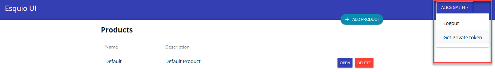
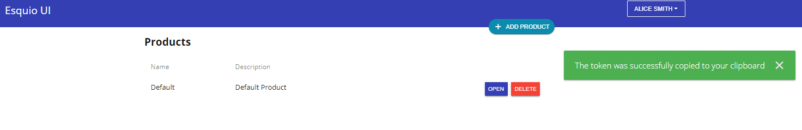
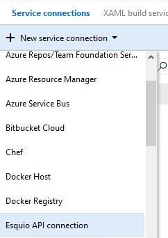
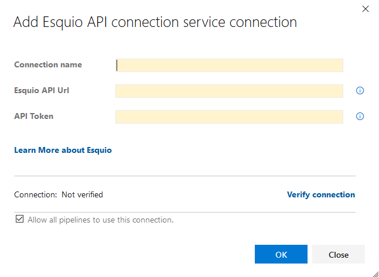
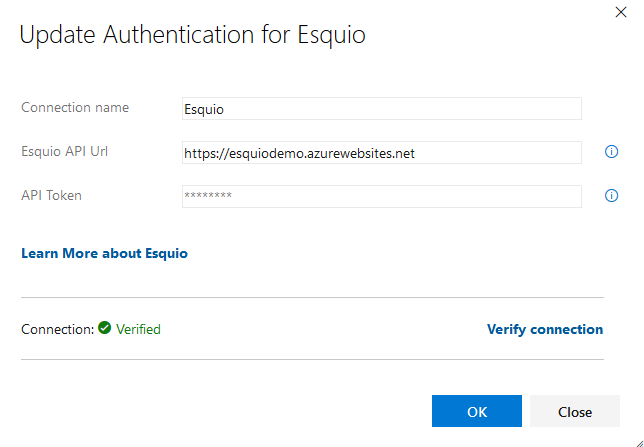
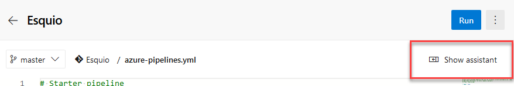
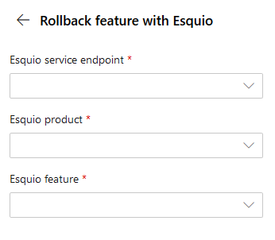
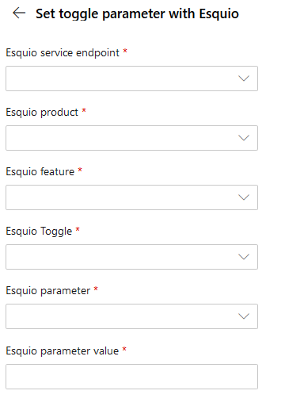

Getting started with Esquio Azure DevOps tasks
==============================================

In this article, we are going to see how to configure Esquio Azure DevOps tasks for your pipelines. 

> In `samples/WebApp <https://github.com/Xabaril/Esquio/tree/master/samples/WebApp>`_ you'll find a complete Esquio example in ASP.NET Core.

Setup
^^^^^
The first step is install the `Esquio Azure DevOps Task from Visual Studio Marketplace <https://marketplace.visualstudio.com/items?itemName=xabaril.esquio*extensions>`_ . There isn't anything special needed, just install it as a normal Azure DevOps extension.

Once installed, you will have new elements in your Azure DevOps:

    * Esquio Service Connection
    * Esquio rollout task
    * Esquio rollback task
    * Esquio set parameter value task

Prerequisites
^^^^^^^^^^^^^
To be able to use Esquio tasks, we will need to setup a Esquio `Service Connection  <https://docs.microsoft.com/en-us/azure/devops/pipelines/library/service-endpoints?view=azure-devops&tabs=yaml>`_ and to configure it you need to create an Esquio API key, to use it with the Esquio Service Connection.

Create Esquio API key
^^^^^^^^^^^^^^^^^^^^^
First of all you need to create an Esquio API key to create the `Service Connection  <https://docs.microsoft.com/en-us/azure/devops/pipelines/library/service-endpoints?view=azure-devops&tabs=yaml>`_ it is easily created with the Esquio UI.

Open your current deployment of Esquio UI url in a browser, and once logged-in, click on your user name in the upper right corner.

Click on *Get Private token* and you will receive a confirmation window, and your token will be copied to the clipboard, so note it to paste it when configuring the Esquio Service Connection

Now you can continue to configure the `Service Connection  <https://docs.microsoft.com/en-us/azure/devops/pipelines/library/service-endpoints?view=azure-devops&tabs=yaml>`_.

Setup Esquio Service Connection
^^^^^^^^^^^^^^^^^^^^^^^^^^^^^^^
`Service Connection  <https://docs.microsoft.com/en-us/azure/devops/pipelines/library/service-endpoints?view=azure-devops&tabs=yaml>`_ are setup per project, so open your Azure DevOps settings page, and go to Service Connections, click on *New service Connection* and select *Esquio API Connection*

This will bring the *Esquio API Connection* configuration screen, here you need to setup three parameters:

    * **Connection name:** To use it in the Azure DevOps tasks.
    * **Esquio API Url:** The complete url in which yoy have your Esquio API.
    * **API token:** The Esquio API key you have setup.

Once filled all the information, make sure it is correct, clicking on *Verify connection* and make sure it says *Connection: Verified*

Now you have setup the Esquio Connection we will need to use for the tasks.

Esquio rollout task
^^^^^^^^^^^^^^^^^^^
This task allow us to enable a feature to everyone cleaning all the toggles.

If you are creating your Azure Pipelines with *YAML* it is better to use the *YAML assistant* as it will allow you to use the datasources for the picklists.

To setup the rollout task, look for **Rollout feature with Esquio** task:

.. image:: ../images/rollout-blank.png

We will configure three parameters:

    * **Esquio Service Endpoint:** Select the previously created *Esquio Service Connection*.
    * **Esquio Product:** From the list of products configured in Esquio.
    * **Esquio feature:** Select, from the list of features.

The final YAML should be (with different ids) like this:

.. code-block:: yaml

        - task: esquio-rollout-feature@1
          inputs:
            EsquioService: 'Esquio'
            productId: '1'
            flagId: '1'

If you are using the classic pipelines (the visual ones), the setup is exactly the same.

Esquio rollback task
^^^^^^^^^^^^^^^^^^^^

This task allow us to set a :doc:`OffToggle <../toggles/esquio>` for a feature, thus disabling it.

If you are creating your Azure Pipelines with *YAML* it is better to use the *YAML assistant* as it will allow you to use the datasources for the picklists.

To setup the rollout task, look for **Rollback feature with Esquio** task:

We will configure three parameters:

    * **Esquio Service Endpoint:** Select the previously created *Esquio Service Connection*.
    * **Esquio Product:** From the list of products configured in Esquio, select the one with the feature you want to setup the *OffToggle*.
    * **Esquio feature:** Select, from the list of features, the one to setup the *OffToggle*.

The final YAML should be (with different ids) like this:

.. code-block:: yaml

        - task: esquio-rollback-feature@1
          inputs:
            EsquioService: 'Esquio'
            productId: '1'
            flagId: '1'

If you are using the classic pipelines (the visual ones), the setup is exactly the same.

Esquio set toggle parameter task
^^^^^^^^^^^^^^^^^^^^^^^^^^^^^^^^

This task allow us to set a value for a particular parameter in a toggle, with this task you can setup any other type of :doc:`toggle <../toggles/esquio>` acepting parameters.

If you are creating your Azure Pipelines with *YAML* it is better to use the *YAML assistant* as it will allow you to use the datasources for the picklists.

To setup the rollout task, look for **Set toggle parameter with Esquio** task and select, using the picklists, the parameter for the feature toggle you want to set, and then fill-in the value you want to set for the parameter:

We will configure six parameters:

    * **Esquio Service Endpoint:** Select the previously created *Esquio Service Connection*.
    * **Esquio Product:** From the list of products configured in Esquio.
    * **Esquio feature:** Select, from the list of features, the one with the parameter you want to set the value.
    * **Esquio toggle:** Select, from the list of toggles, the one with the parameter you want to set the value.
    * **Esquio parameter:** Select, from the list of parameters for the previously selected toggle, the one you want to set the value.
    * **Esquio parameter value:** Introduce manually the value you want to setup for the parameter.

The final YAML should be (with different ids) like this:

.. code-block:: yaml

        - task: set-toggle-parameter@1
          inputs:
            EsquioService: 'esquio'
            productId: '1'
            flagId: '2'
            toggleId: '14'
            parameterId: 'Percentage'
            parameterValue: '59'

If you are using the classic pipelines (the visual ones), the setup is exactly the same.