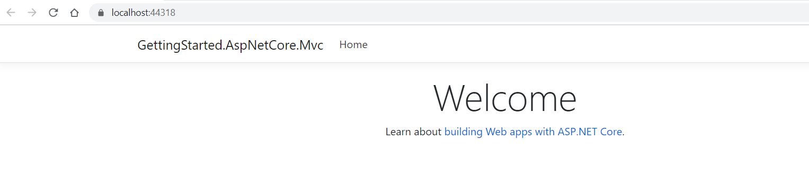
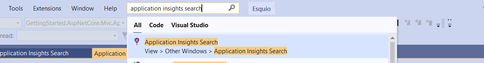
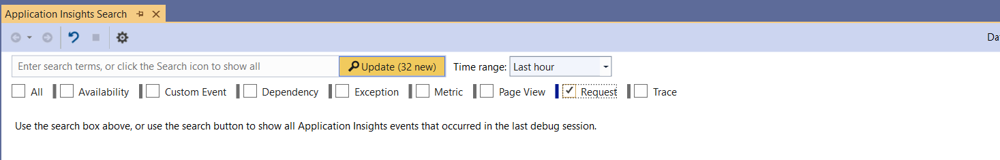
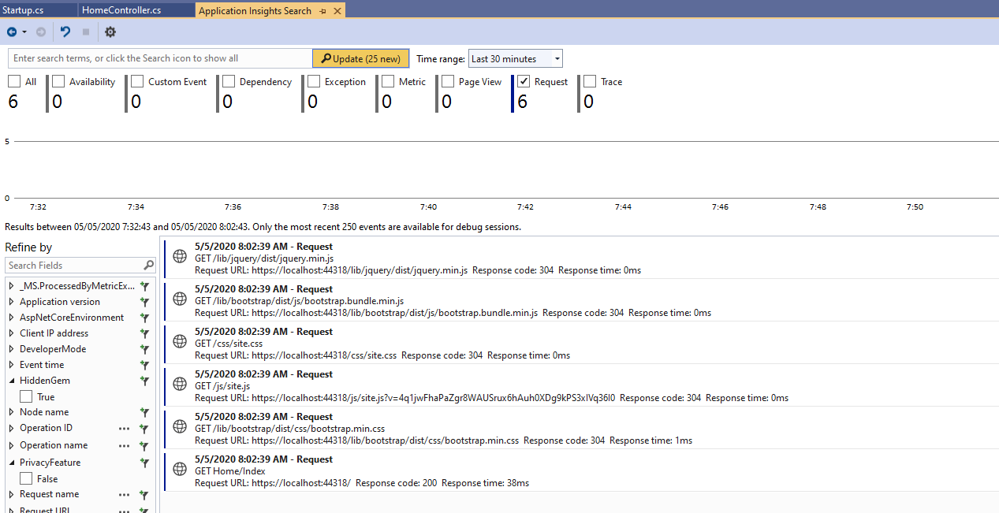

Getting started with Esquio monitoring & diagnostics
====================================================

In this article, we are going to watch an incremental sample to show how to use to use Esquio in your ASP.NET Core application.

Intro
^^^^^

Application Insights
^^^^^^^^^^^^^^^^^^^^
> In `samples/GettingStarted.AspNetCore.Mvc.ApplicationInsights <https://github.com/Xabaril/Esquio/tree/master/samples/GettingStarted.AspNetCore.Mvc.ApplicationInsights>`_ you'll find this example in ASP.NET Core.

An easy way to discover what is happening in our application is using `ApplicationInsights`.

First, install ``Microsoft.ApplicationInsights.AspNetCore`` package, typing the following command using the .NET Core CLI::

        dotnet add package Microsoft.ApplicationInsights.AspNetCore

or using Powershell or Package Manager::

        Install-Package Microsoft.ApplicationInsights.AspNetCore

or install via NuGet.

On the `Startup`class, modify your `ConfigureServices` method::

        public void ConfigureServices(IServiceCollection services)
        {
            services.AddControllersWithViews()
                .Services
                .AddEsquio(setup =>
                {
                    setup.UseScopedEvaluation(useScopedEvaluation: true);
                })
                .AddAspNetCoreDefaultServices()
                .AddApplicationInsightProcessor()
                .AddConfigurationStore(Configuration);
        }

> We set on the configuration `ScopedEvaluation` to use evaluation session, that is, to store feature evaluation results on the same execution scope. This ensures result consistency on the same scope. By default, a no evaluation holder is used and scoped evaluation results are never stored and reused.
                 
To register `ApplicationInsights` telemetry and `Esquio` customized processor, we had just added the following extension::

                .AddApplicationInsightProcessor()

Open this sample and launch it. It will open a very simple Mvc application.

Let's open `ApplicationInsights` watcher typing `Application Insights Search` on the `Search` field of your Visual Studio or clicking on `View> Other Windows> Application Insights Search`:

In this sample, we are interested on the `Request`, so select only this option and click on `Update` button:

On the results, same requests should be shown. On the left, among the fields to refine by, you can see `HiddenGem` and `PrivacyFeature`:

Let's go to the `appsettings.json`, enable the `PrivacyFeature`::

  "Esquio": {
    "Products": [
      {
        "Name": "default",
        "Features": [
          {
            "Name": "PrivacyFeature",
            "Enabled": true,
            "Toggles": []
          },
          {
            "Name": "HiddenGem",
            "Enabled": true,
            "Toggles": []
          }
        ]
      }
    ]
  }

Launch the application and open `Application Insights Search` again. A new value for `PrivacyFeature` filter appears. 

In this way, you can filter among all your requests showing only the request when `PrivacyFeature` is enable. This can be very useful on canary release to be able to detect undesirable behaviours.
 

Dotnet Counter
^^^^^^^^^^^^^^
> `Counters <https://docs.microsoft.com/es-es/dotnet/core/diagnostics/dotnet-counters>`_ 

VisualStudio Diagnostics
^^^^^^^^^^^^^^^^^^^^^^^^
PerfWatcher
^^^^^^^^^^^