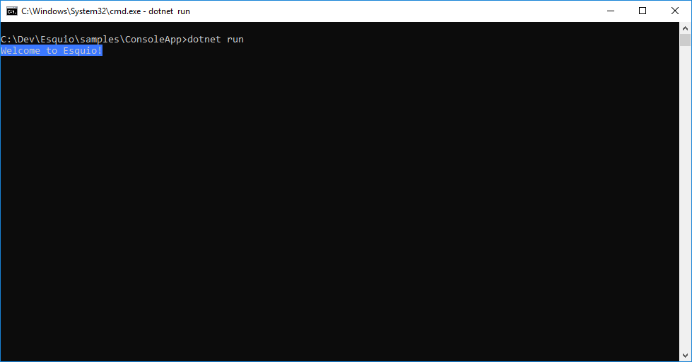
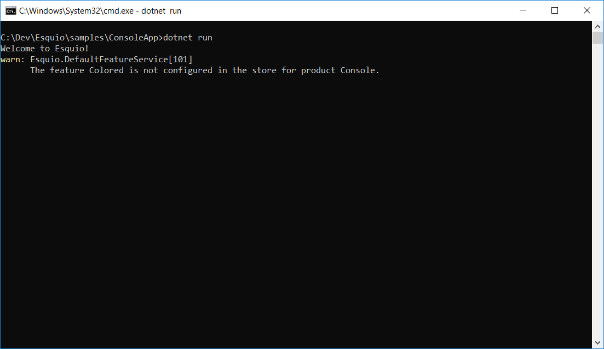

# Getting started with Esquio in .NET Core

In this article, we are going to see how easy it is to use Esquio in your .NET Core application using the NuGet packages provided by Xabaril.

> In [samples/ConsoleApp](https://github.com/Xabaril/Esquio/tree/master/samples/ConsoleApp) you'll find a complete Esquio example in ASP.NET Core.

## Create a folder for your new project

Open a command prompt an run:

```
mkdir consoleapp
cd consoleapp
```

## Create the project

To create the project type the following command using the .NET Core CLI

```
dotnet new console
```

## Installation

To install Esquio type the following command:

```
dotnet package add Microsoft.Extensions.DependencyInjection
dotnet package add Microsoft.Extensions.Logging.Console
dotnet package add Microsoft.Extensions.Configuration.Json
dotnet package add Esquio
dotnet restore
```

or using Powershell or Package Manager:

```
Install-Package Microsoft.Extensions.DependencyInjection
Install-Package Microsoft.Extensions.Logging.Console
Install-Package Microsoft.Extensions.Configuration.Json
Install-Package Esquio
```

## Setup

In the Program.cs change the Main method to async:

```csharp
static async Task Main(string[] args)
```

Import the configuration namespace:

```csharp
using Microsoft.Extensions.Configuration;
```

Create the configuration object:

```csharp
var configuration = new ConfigurationBuilder()
  .SetBasePath(Directory.GetCurrentDirectory())
  .AddJsonFile("appsettings.json")
  .Build();
```
Add a **appsettings.json** file to the project and add the content below:

```json
{
  "Esquio": {
    "Products": [
      {
        "Name": "Console",
        "Features": [
          {
            "Name": "Colored",
            "Enabled": true,
            "Toggles": [
              {
                "Type": "Esquio.Toggles.OnToggle"
              }
            ]
          }
        ]
      }
    ]
  }
}
```

Register the Esquio services and the configuration store:

```csharp
var services = new ServiceCollection()
  .AddLogging(configure => configure.AddConsole())
  .AddEsquio()
  .AddConfigurationStore(configuration, "Esquio")
  .Services;
```

Build the service provider:

```csharp
var serviceProvider = services.BuildServiceProvider();
```

Obtain a context for the **IFeatureService**:

```csharp
var featureService = serviceProvider.GetService<IFeatureService>();
```

Check if "Colored" feature for the "Console" project is enabled and set the background color of the console to blue:

```csharp
if (await featureService.IsEnabledAsync("Colored", "Console"))
{
  Console.BackgroundColor = ConsoleColor.Blue;
}
```

Finally write a message to check it:

```csharp
Console.WriteLine("Welcome to Esquio!");
Console.Read();
```
## Test the application

Test the app from your machine running:

```
dotnet run
```



To disable the feature, change the **appsettings.json**:

```json
"Enabled": false,
```

Test again the app:



