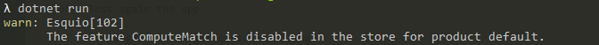
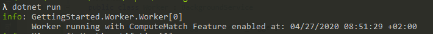

Getting started with Esquio in .NET Core Worker
========================================

In this article, we are going to see how easy it is to use Esquio in your .NET Core worket using the NuGet packages provided by Xabaril.

> In `samples/GettingStarted.Worker <https://github.com/Xabaril/Esquio/tree/master/samples/GettingStarted.Worker>`_ you'll find a complete Esquio example in a .Net core worker.

In this sample, a different message will be shown according with the state of the feature named ``ComputeMatch``. This feature will be store in the configuration.

Create the project
^^^^^^^^^^^^^^^^^^

To create the project type the following command using the .NET Core CLI::

        dotnet new worker -n GettingStarted.Worker
        cd GettingStarted.Worker

Installation
^^^^^^^^^^^^

To install Esquio type the following command::

        dotnet add package Esquio
        dotnet add package Esquio.Configuration.Store
        dotnet restore

or using Powershell or Package Manager::

        Install-Package Esquio
        Install-Package Esquio.Configuration.Store

> In addition to Esquio package, it going to install the specific package for using ``configuration`` as the Esquio store.

Setup
^^^^^

In the ``Program.cs``, modify the ``CreateHostBuilder`` to register Esquio services and the specific configuration store::

        public static IHostBuilder CreateHostBuilder(string[] args) =>
            Host.CreateDefaultBuilder(args)
                .ConfigureServices((context, services) =>
                {
                    services
                        .AddEsquio()
                        .AddConfigurationStore(context.Configuration, key: "Esquio");

                    services.AddHostedService<Worker>();
                });

Modify the ``appsettings.json`` file to the project and add the content below::

  "Esquio": {
    "Products": [
      {
        "Name": "default",
        "Features": [
          {
            "Name": "ComputeMatch",
            "Enabled": false,
            "Toggles": []
          }
        ]
      }
    ]
  }

Let's consume this feature. In the ``Worker.cs``, create a new property ``scopeFactory`` and change the Worker method to receive it as a parameter::

        private readonly ILogger<Worker> _logger;
        private readonly IServiceScopeFactory _scopeFactory;

        public Worker(IServiceScopeFactory scopeFactory, ILogger<Worker> logger)
        {
            _scopeFactory = scopeFactory;
            _logger = logger;
        }

Import the ``DependencyInjection`` extension namespace::

using Microsoft.Extensions.DependencyInjection;

Change the method ``ExecuteAsync`` for creating a new context and require a ``IFeatureService`` ::

        protected override async Task ExecuteAsync(CancellationToken stoppingToken)
        {
            while (!stoppingToken.IsCancellationRequested)
            {
                using (var scope = _scopeFactory.CreateScope())
                {
                    var featureService = scope.ServiceProvider
                        .GetRequiredService<IFeatureService>();
                }

Import the ``Esquio.Abstractions`` namespace for resolving ``IFeatureService``::

using Esquio.Abstractions;

Using this service, you can implement the logic to show a different message on the console according with the feature in several ways.

You can use it querying the feature and receiving a boolean result depending on its state::

        protected override async Task ExecuteAsync(CancellationToken stoppingToken)
        {
            while (!stoppingToken.IsCancellationRequested)
            {
                using (var scope = _scopeFactory.CreateScope())
                {
                    var featureService = scope.ServiceProvider.GetRequiredService<IFeatureService>();

                    if (await featureService.IsEnabledAsync("ComputeMatch"))
                    {
                        _logger.LogInformation("Worker running with ComputeMatch Feature enabled at: {time}", DateTimeOffset.Now);
                    }
                    _logger.LogInformation("Worker running at: {time}", DateTimeOffset.Now);

                    await Task.Delay(1000, stoppingToken);
                }
            }
        }

Or using the method `Do` where you can explictly define both states in different actions::

        protected override async Task ExecuteAsync(CancellationToken stoppingToken)
        {
            while (!stoppingToken.IsCancellationRequested)
            {
                using (var scope = _scopeFactory.CreateScope())
                {
                    var featureService = scope.ServiceProvider
                        .GetRequiredService<IFeatureService>();

                    await featureService.Do("ComputeMatch",
                        enabled: () =>
                        {
                            _logger.LogInformation("Worker running with ComputeMatch Feature enabled at: {time}", DateTimeOffset.Now);
                        },
                        disabled: () =>
                        {
                            _logger.LogInformation("Worker running at: {time}", DateTimeOffset.Now);
                        });

                    await Task.Delay(1000, stoppingToken);
                }
            }
        }

Test the application
^^^^^^^^^^^^^^^^^^^^

Test the app from your machine running::

        dotnet run

To enable the feature, change the ``appsettings.json``::

        "Enabled": true

Test again the app:

