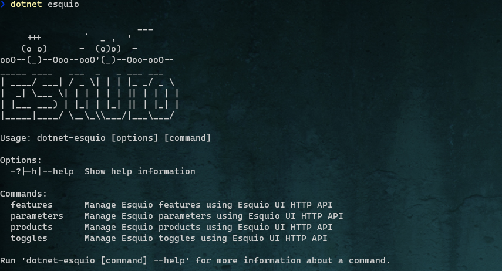

Esquio CLI
==========

**Esquio.CLI** is a simple crossplattform *dotnet tool* that allow you to interact with *Esquio UI* from the command line. This tool can be used from build or release pipelines on Azure DevOps, Github Actions etc.

To install **Esquio.CLI** open a console window and type the following command using the *.NET Core CLI*::

        dotnet tool install -g Esquio.Cli

::

 Usage: dotnet-esquio [options] [command]

 Options:
   -?|-h|--help  Show help information

Commands:
  **features**  
    *Manage Esquio features using Esquio UI HTTP API*

  **parameters**    
    *Manage Esquio parameters using Esquio UI HTTP API*

  **products**      
    *Manage Esquio products using Esquio UI HTTP API*

  **toggles**       
    *Manage Esquio toggles using Esquio UI HTTP API*

Run 'dotnet-esquio [command] --help' for more information about a command.

All the commands allow to specify the *uri* and the *api key* to connect with Esquio UI, if don't want to specify this parameters in all calls, *Esquio CLI* allow read this values form the ESQUIO_URI and ESQUI_API_KEY environment variables.::

        $env:ESQUIO_URI="https://[esquio_uri]"
        $env:ESQUIO_API_KEY="[my-api-key]"