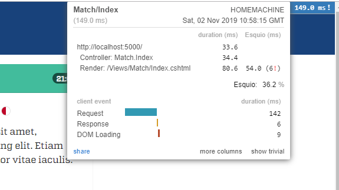
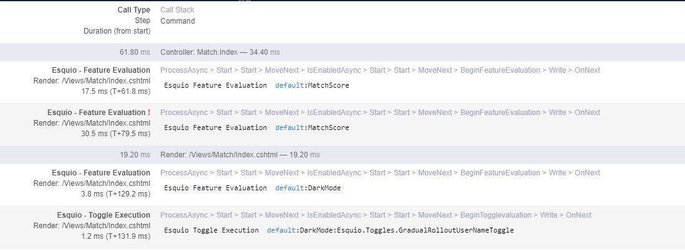

Esquio & MiniProfiler
=====================

`MiniProfiler <https://miniprofiler.com/>`_ is a *simple but effective mini-profioder for .NET*. It provides a *Step instrumentation* that you can add to the code you want to explicitly profile. Out of the box, *MiniProfiler* contains plugins for profiling ASP.NET Core, EF Core. But is extensible!.

We use this extensiblity to perform profiling over *Esquio* feature evaluations and show the elapsed evaluation time for each feature, each toggle and also show common errors for duplicate feature evaluation or exceptions inside toggle executions.

Setup
^^^^^

To install **MiniProfiler.Esquio** open a console window and type the following command using the *.NET Core CLI*::

        dotnet package add MiniProfiler.Esquio

or using *Powershell* or *Package Manager*::

        Install-Package Esquio.AspNetCore

To configure MiniProfiler.Esquio on ASP.NET Core, add MiniProfiler service configuration and new *Esquio* plugin with **AddEsquio**::

            services
                .AddMiniProfiler(options =>
                {
                    options.RouteBasePath = "/profiler";
                    options.EnableServerTimingHeader = true;

                    options.ResultsAuthorize = (_) => true;
                    options.ShouldProfile = _ => true;

                    options.IgnoredPaths.Add("/lib");
                    options.IgnoredPaths.Add("/css");
                    options.IgnoredPaths.Add("/js");
                    options.IgnoredPaths.Add("/assets");

                }).AddEsquio();

