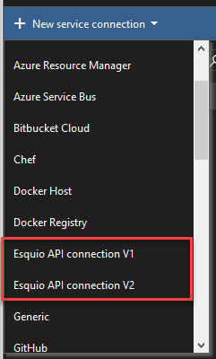
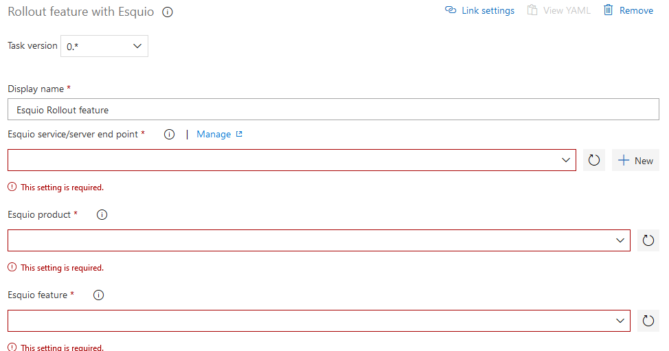
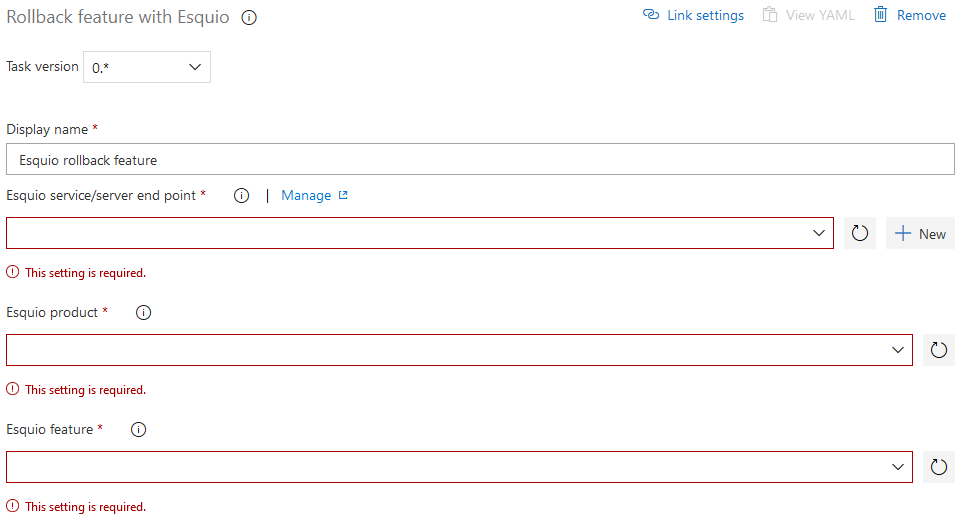
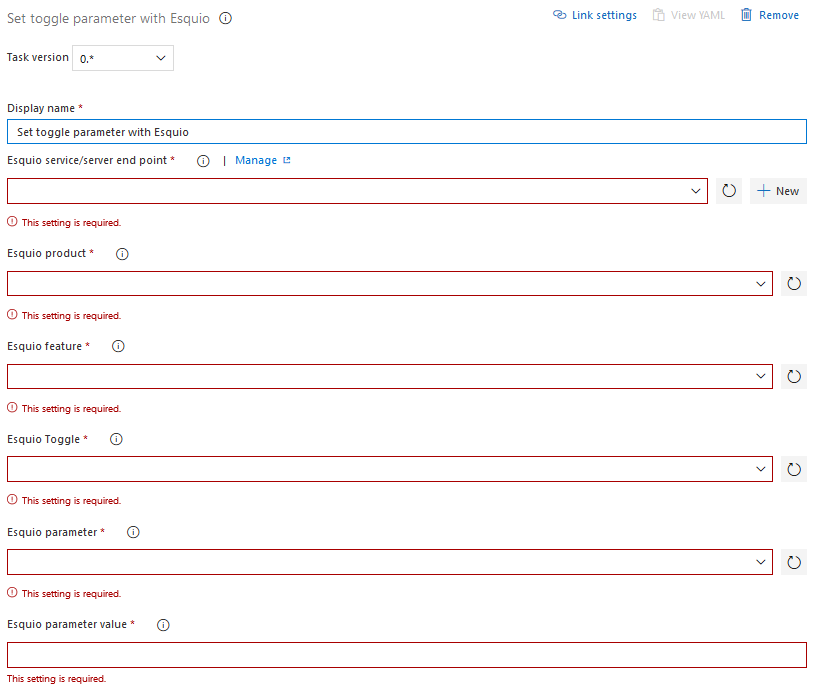

# Esquio Extensions

This Azure DevOps Extension includes several Azure DevOps Pipelines tasks for Feature Toggles package [Esquio](https://esquio.readthedocs.io/en/latest/).

Please read [Esquio readthedocs](https://esquio.readthedocs.io/en/latest/) first to fully understand Esquio Feature Toggle package configuration and possibilities.

The tasks included in this version are:

- **Rollout feature:** With this task you can enable a feature in an Azure DevOps Pipeline.
- **Rollback feature:** This task is used to disable (rollback) a feature during an Azure DevOps Pipeline.
- **Set toggle parameter:** Some Esquio toggles accepts parameters, like for example a gradual rollout of a particular feature based in a percentage and a partition identifier. This task is used to change any parameter value of a particular toggle.

## Service connection

Before being able to use any of this tasks you need to create an Esquio [Service Connection](https://docs.microsoft.com/en-us/azure/devops/pipelines/library/service-endpoints?view=azure-devops&tabs=yaml) (enabled after installing the extension) and configure an API key in Esquio to use it with the service connection.

Depending on which version of Esquio (v1.0 or v2.0) you are using you have to types of Esquio Service connection. Use the one according to the version of Esquio you are using, as there are changes in the API which will affect it.

The parameters needed are:

- Name for the connection to be used in the Azure DevOps Pipelines
- Esquio API URL
- API Token, API key configured in Esquio.

Once you enter all the values you can click on *Verify connection* to check if the connection is well configured.

## Task versioning

As with the service connection the tasks depending on which version of Esquio you are using (v1.0, v2.0, v3.0), when adding them to your pipelines be sure to use the right version, using *@1*, *@2*, or *@3* at the end of the task name.

## Rollout feature with Esquio task

Parameters for this task are:

- **Esquio service endpoint:** This is a picklist to select the desired Esquio Service Connection.
- **Esquio Product:** Picklist to select any of the configured products in Esquio. In v2.0 and v3.0, instead of the numeric *id* we use the product name from Esquio.
- **Esquio deployment:** New for v3.0. Allows you to select in which deployment to rollout the feature.
- **Esquio feature:** Picklist to select the Esquio feature desired to enable. In v2.0 and v3.0, instead of the numeric *id* we use the feature name from Esquio.

## Rollback feature with Esquio task

Parameters for this task are:

- **Esquio service endpoint:** This is a picklist to select the desired Esquio Service Connection.
- **Esquio Product:** Picklist to select any of the configured products in Esquio. In v2.0 and v3.0, instead of the numeric *id* we use the product name from Esquio.
- **Esquio deployment:** New for v3.0. Allows you to select in which deployment to rollback the feature.
- **Esquio feature:** Picklist to select the Esquio feature desired to rollback. In v2.0 and v3.0, instead of the numeric *id* we use the feature name from Esquio.

## Set toggle parameter with Esquio

Parameters for this task are:

- **Esquio service endpoint:** This is a picklist to select the desired Esquio Service Connection.
- **Esquio Product:** Picklist to select any of the configured products in Esquio. In v2.0 and v3.0, instead of the numeric *id* we use the product name from Esquio.
- **Esquio deployment:** New for v3.0. Allows you to select in which deployment to set the parameter for the toggle.
- **Esquio feature:** Picklist to select the Esquio feature desired to rollback. In v2.0 and v3.0, instead of the numeric *id* we use the feature name from Esquio.
- **Esquio toggle:** Picklist for Esquio toggle for the feature to set a particular parameter. In v2.0 and v3.0, instead of the numeric *id* we use the toggle type name from Esquio.
- **Esquio parameter:** Picklist for the Esquio parameter, associated with the toggle, to set the value. In v2.0 and v3.0, instead of the numeric *id* we use the parameter name from Esquio.
- **Esquio parameter value:** New value for the Esquio Toggle parameter.
